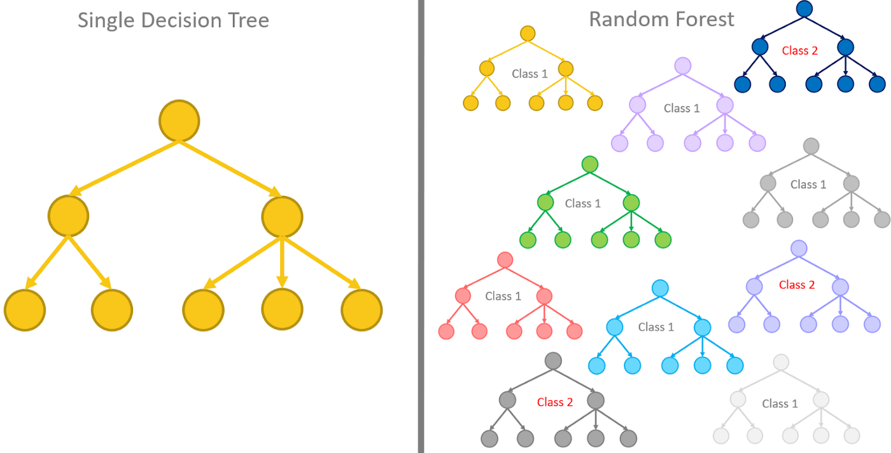
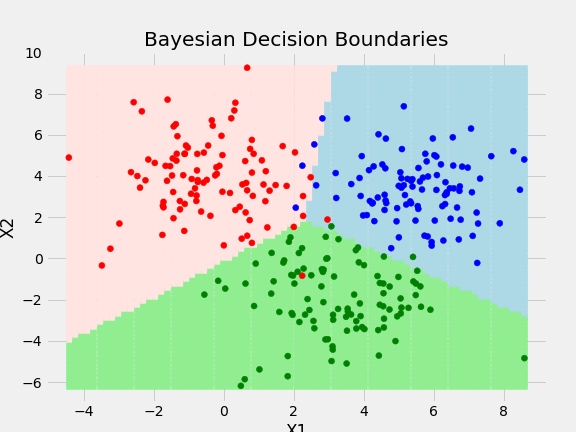
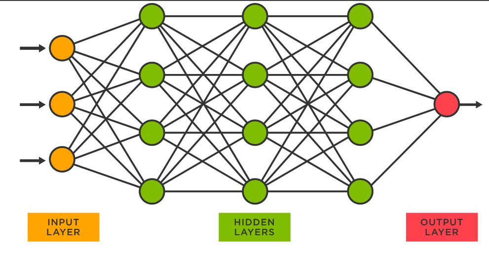
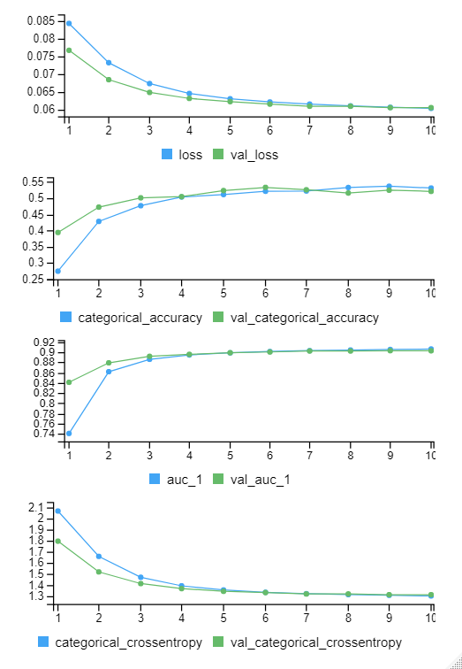

# Introduction

The goal of this project is to answer the question: Can we predict the genre of a song using the attributes provided by the Spotify API data? We will begin with an exploratory data analysis (EDA), followed by building and assessing the metrics of various machine learning models in order to discover the best predictive model.

[The data set that I am going to be using can be found here.](https://www.kaggle.com/datasets/vicsuperman/prediction-of-music-genre)

<center></center>

## Spotify API Data

The Spotify API provides us useful data about every song, including tempo, key, and popularity; as well as metrics that are calculated by machine learning algorithms such as danceability, acousticness, and valence. [This article posted on *Towards Data Science*](https://towardsdatascience.com/what-makes-a-song-likeable-dbfdb7abe404#:~:text=Spotify%20Audio%20Features&text=The%20Spotify%20Web%20API%20developer,beat%20strength%2C%20and%20overall%20regularity.) has a more in depth explanation on how these values are calculated.

A full codebook including variables and their descriptions can be found in the data section of the project, but here is the list of variables we will be using to generate our predictions. It is also important to note that the Spotify API provides artist name and song name, which we will not be using in the computations of predictions in the interest of processing power; a more rigorous model could incorporate natural language processing in order to use these variables.

-   `Popularity`

-   `Acousticness`

-   `Danceability`

-   `Duration (ms)`

-   `Energy`

-   `Instrumemtalness`

-   `Key`

-   `Liveness`

-   `Loudness`

-   `Mode`

-   `Speechiness`

-   `Tempo`

-   `Valence`

-   `Music Genre`

## Data Processing

These are all of the libraries that we will be using throughout this project

```{R message = FALSE}
library(tidyverse)
library(tidymodels)
library(ISLR)
library(rpart.plot)
library(vip)
library(janitor)
library(randomForest)
library(xgboost)
library(ranger)
library(corrplot)
library(ISLR)
library(tictoc)
library(doParallel)
library(alr4)
library(caret)
library(keras)
library(tensorflow)
```

## Variable Cleaning

Importing the raw data set and removing the unnecessary columns

```{R eval = FALSE}
genre <- read.csv('data/unprocessed/music_genre.csv')

genre <- genre %>%
  select(-c(instance_id, track_name, artist_name, obtained_date))
```

First, we will remove any NULL values from the data set. In the data set, there are missing values for 'duration_ms' that are represented as the numeric value '-1', and missing values for tempo that are represented as '?'. We will remove observations that have these missing values as they will hinder our data visualizations and predictive models.

```{R eval = FALSE}
genre <- drop_na(genre)

genre <- genre %>%
  filter(duration_ms != -1) %>%
  filter(tempo != '?')
```

Currently, tempo is considered a string, so we will coerce it as a numeric value:

```{R eval = FALSE}
genre$tempo <- as.numeric(genre$tempo)
```

## Generating our Final Data Set

As mentioned previously, the data set has \~50,000 individual observations, so in the interest of time and computing power, we will be selecting a subset of 10,000 to train and test our models

```{R eval = FALSE}
set.seed(727)
genre <- genre[sample(1:nrow(genre), 10000, replace = FALSE),]
```

## Exporting the Data Set

Now, we will export our clean data frame as a csv file so we are able to easily access it in the future

```{R eval = FALSE}
write.csv(genre, "data/processed/processed_data.csv")
```

## Data Splitting and K-Fold Validation

The purpose of splitting the data into a training and testing set is that we use the training set to train the models, and use the testing set to evaluate the performance of the model. The reason we don't want to use the training set as a hard method to evaluate model performance is because not only does the model use that data to train, but it also prevents us from tuning the model to overfit the training data, inflating our accuracy result

The purpose of using the K-Fold cross validation is because it is useful for estimating the performance of the models when training. We use K-1 subsets of the training data, and reserve 1 subset to cross validate our results. This results in a model that is much less prone to overfitting.

```{R}
# Loading Clean Data
genre <- read.csv('data/processed/processed_data.csv', stringsAsFactors = TRUE)
```

```{R}
# Splitting the data
set.seed(727)
genre_split <- initial_split(genre, prop = .8)

genre_train <- training(genre_split)
genre_test <- testing(genre_split)
```

```{R}
# Creating 8 fold validation
genre_fold <- vfold_cv(genre_train, v = 8, strata = music_genre)
```

# Exploratory Data Analysis

In this section of the project we will explore the cleaned data. We will accomplish this by asking informative questions about the data and answering them with intuitive visualizations.

## Music Genre Levels

It is important to first understand what we are trying to predict. Some preliminary questions surrounding the music_genre variable are:

-   **How many levels are in the music genre variable?**

-   **Is our data set a balanced or unbalanced data set?**

```{R fig.height=6, fig.width=10}
genre %>%
  ggplot(aes(x = music_genre, fill = music_genre)) +
  geom_bar() +
  scale_fill_brewer(palette = "Spectral")
```

There are ten levels to the music genre class and they are:

-   `Alternative`

-   `Anime`

-   `Blues`

-   `Classical`

-   `Country`

-   `Electronic`

-   `Hip-Hop`

-   `Jazz`

-   `Rap`

-   `Rock`

Additionally, our data set is a balanced data set. This is useful information to us as it will allow us to use accuracy metrics if we so choose when building our models. Accuracy metrics can be misleading when using an unblanced data set as even a model that does not discern classes can seem to have good accuracy just due to the disproportionate amount of one level compared to another. *Since our data set is somewhat balanced, we can expect that random classifications of music genre will have about a 10% accuracy.*

## Distribution of the Predictors

Next, I would like to assess the distribution of our numerical predictors. This can help us answer some key questions such as:

-   **Do some/all/none of our predictors follow a known distribution?**

-   **Is there any other obvious anomalies that can be seen by assessing the distributions?**

```{R fig.height=6, fig.width=10, message=FALSE}
genre_numeric <- genre %>%
  select(-c(X, key, mode, music_genre)) %>%
  pivot_longer(everything(), names_to = "variable", values_to = "value") %>%
  arrange(variable)

genre_numeric %>%
  ggplot(aes(x=value, fill = variable)) +
  geom_histogram() +
  facet_wrap(~ variable, scales = "free") +
  labs(title = "Distribution of Spotify Variables")
```

After plotting a histogram of our predictors, it is clear to see that danceability, energy, tempo, popularity and valence follow somewhat normal distributions skewed to one side. This is interesting as these predictors would suggest that there a wide variation in a lot of our predictors, which could be helpful to our models.

Instrumentalness, duration, acousticness and speechiness all have many values around 0, which would suggest that the majority of songs have low levels for these values.

For the next part of the exploratory analysis we will be focusing on tempo, popularity and danceability, as these variables have a wide variation which could indicate a correlation with different levels of music_genre.

## High Variability Predictors vs. Music Genre

In this section of the analysis we will be using density charts to see if there are trends for the density of different music genres vs the key predictors we have identified.

**An important note on reading density charts:** A high density for a particular music genre does not necessarily mean there are a lot of observations at that value, but rather, out of all of the observations at a particular x value, most of them are of that music class. Additionally, density charts can be heavily skewed when using an unbalanced data set, but since we are using a balanced one, the results should be significant.

We can use these charts to answer the question:

-   **Is there discernible differences in the density plots for tempo, popularity, and danceability that can help us identify trends in our data?**

```{R fig.height=6, fig.width=10,}
genre %>%
  ggplot(aes(x=tempo, color = music_genre, fill = music_genre)) +
  geom_density(position = "fill", color = "#00000000") +
  scale_fill_brewer(palette = "Spectral")
```

Across all but one music genre, tempo seems to have an even density distribution across all of the values. Classical music genre is the only one that stands out, as it holds the highest density by far for songs on the very slow end of the tempo distribution, while holding very few on the high tempo side.

```{R fig.height=6, fig.width=10,}
genre %>%
  ggplot(aes(x=popularity, color = music_genre, fill = music_genre)) +
  geom_density(position = "fill", color = "#00000000") +
  scale_fill_brewer(palette = "Spectral")
```

For popularity, the low end of the spectrum is dominated by classical, and anime music. On the other hand, all of the most popular songs have a music genre of rap and hip-hop, with rock sharing a high popularity density.

It is also important to note that there are very few classical and anime songs that have a high popularity and a few amount of rap and hop-hop songs that have a low popularity.

These results are in accordance with intuitive thinking as classical music would generally be considered one of the least popular music genre, while rap would be considered the most popular genre, although I'm sure that if these metrics were calculated 100 years ago, we would have significantly different results.

```{R fig.height=6, fig.width=10}
genre %>%
  ggplot(aes(x=danceability, color = music_genre, fill = music_genre)) +
  geom_density(position = "fill", color = "#00000000") +
  scale_fill_brewer(palette = "Spectral")
```

For danceability, classical music dominates the lower values, while hip-hop and rap dominate the upper values. All of the other music genres seem to have an even distribution of danceability across the middle values.

In conclusion, our results suggest that classical music is easily identifiable among the data, as it is usually alone when dominating a density for a certain value. Rap and hip-hop are also usually clear in the density they hold, but it could be hard to discern those two levels from each other.

## Assessing Multicollinearity for Numeric Predictors

In this section of the analysis we will be trying to answer the questions:

-   **Does this data set experience multicollinearity, and if so, what predictors are highly correlated with each other?**

```{R fig.height=6, fig.width=10}
M <- genre %>%
  select(popularity, acousticness, danceability, duration_ms, energy, instrumentalness, liveness, loudness, speechiness, tempo, valence)

testRes = cor.mtest(M, conf.level = 0.95)

M <- cor(M)

corrplot(M, p.mat = testRes$p, method = 'circle', type = 'lower', insig='blank',
         addCoef.col ='black', number.cex = 0.8, order = 'AOE', diag=FALSE)
```

Assessing the correlation plot of the predictors, we can see that there are some sets of variables that are highly correlated with each other.

-   `Energy vs Loudness (.84)`

-   `Energy vs Acousticness (.79)`

-   `Loudness vs Acousticness (.73)`

Energy, Loudness and Acousticness all experience a high correlation with each other. This could be problematic for some machine learning models. Usually you would have to deal with this by removing two of them as presumably the information they capture is already contained in the other variables. Since the models we will be building are not affected by multicollinearity, there is no real reason to remove variables, so we will keep them.

# Model Building

In this section of the project, we will be building various machine learning models to try to find the best model for predicting music genre given the predictors. The models we are building are Forest Models, Nearest Neighbors Model, and a Neural Network Model. Here is the process we will be using to build the machine learning models.

Before we begin to build the model, we will create a recipe for the models. After that here is how we will build and assess the quality of our variables.

1.  Create a workflow and tuning grid for the model

2.  Run the model and assess the model metrics

3.  Select the best performing model (based on our selected metric)

4.  Run the best model on the testing set and observe the results

## Creating Recipe

```{R}
genre_recipe <- recipe(music_genre ~ popularity + acousticness + danceability + duration_ms + energy + instrumentalness + liveness + loudness + mode + speechiness + tempo + key, data = genre_train) %>%
  step_dummy(mode) %>%
  step_dummy(key) %>%
  step_normalize(all_predictors())
```

## Forest Models

<center>{width="612"}</center>

In this section, we will be creating three forest models:

1.  Decision Tree

2.  Boosted Forest

3.  Random Forest

The metric I chose to assess the best performing model was mn_log_loss. The reason I chose this was because all of the models experienced a high loss, so I wanted to minimize this value as much as possible. The loss across all of these models was a number that is usually alarmingly high, but since we have so many levels for our final factor, it is not as bad as I first presumed. Further discussion about this will be done at the end of this section.

Additionally, although I included roc auc there are some anomalies with this value that we will discuss in the conclusion of the forest models section.

### Decision Tree

```{R}
# Decision tree specifications
tree_spec <- decision_tree() %>%
  set_engine("rpart")

class_tree_spec <- tree_spec %>%
  set_mode("classification")

# Creating a workflow
tree_workflow <- workflow() %>%
  add_recipe(genre_recipe) %>%
  add_model(class_tree_spec %>% set_args(cost_complexity = tune()))

# Creating a tuning grid
tree_grid <- grid_regular(cost_complexity(range = c(-3, -1)), levels = 15)
```

```{R eval = FALSE}
tree_tune <- tune_grid(
  tree_workflow,
  resamples = genre_fold,
  grid = tree_grid, 
  metrics = metric_set(accuracy, mn_log_loss, roc_auc)
)

write_rds(tree_tune, file = "tree.rds")
```

```{R}
# Using autoplot() on the tuned results
tree_tune <- read_rds(file = "R_scripts/tree.rds")
autoplot(tree_tune)
```

```{R}
# Collecting the metrics of tuned results
tree_tune %>%
  collect_metrics()
```

```{R}
# Selecting the best decision tree based on log loss metric
best_tree <- select_best(tree_tune, metric = "mn_log_loss")

# Finalizing the workflow and fitting our model
class_tree_final <- finalize_workflow(tree_workflow, best_tree)
class_tree_fit <- fit(class_tree_final, data = genre_train)

# Running our model on the testing set
final_tibble <- augment(class_tree_fit, new_data = genre_test)

# Generating Model Results
final_tibble %>% 
  accuracy(truth = music_genre, estimate = .pred_class)

final_tibble %>% 
  mn_log_loss(truth = music_genre, estimate = .pred_Alternative:.pred_Rock)

final_tibble %>% 
  roc_auc(truth = music_genre, estimate = .pred_Alternative:.pred_Rock)
```

### Boosted Forest

```{R}
# Boosted forest specifications
boosted_spec <- boost_tree(trees = tune()) %>%
  set_engine("xgboost") %>%
  set_mode("classification")

# Boosted forest workflow
boosted_workflow <- workflow() %>% 
  add_recipe(genre_recipe) %>% 
  add_model(boosted_spec)

# Boosted forest parameter grid
boosted_grid <- grid_regular(trees(range = c(10, 500)), levels = 8)
```

```{r eval=FALSE}
boosted_tune <- tune_grid(
  boosted_workflow,
  resamples = genre_fold,
  grid = boosted_grid,
  metrics = metric_set(accuracy, mn_log_loss, roc_auc)
)

write_rds(boosted_tune, file = "R_scripts/boosted.rds")
```

```{R}
# Using autoplot() on the tuned results
boosted_tune <- read_rds(file = "R_scripts/boosted.rds")
autoplot(boosted_tune)
```

```{R}
# Collecting the metrics of tuned results
boosted_tune %>% 
  collect_metrics()
```

```{R}
# Selecting the best boosted forest based on log loss metric
best <- select_best(boosted_tune, metric = "mn_log_loss")

# Finalizing the workflow and fitting our model
final_workflow <- finalize_workflow(boosted_workflow, best)
final_fit <- fit(final_workflow, data = genre_train)

# Running our model on the testing set
final_tibble <- augment(final_fit, new_data = genre_test)

# Generating Model Results
final_tibble %>% 
  accuracy(truth = music_genre, estimate = .pred_class)

final_tibble %>% 
  mn_log_loss(truth = music_genre, estimate = .pred_Alternative:.pred_Rock)

final_tibble %>% 
  roc_auc(truth = music_genre, estimate = .pred_Alternative:.pred_Rock)
```

### Random Forest

```{R}
# Random Forest specifications
rf_spec <- rand_forest(mtry = tune(), trees = tune(), min_n = tune()) %>% 
  set_engine("ranger", importance = "impurity") %>% 
  set_mode("classification")

# Creating a workflow
rf_workflow <- workflow() %>%
  add_recipe(genre_recipe) %>%
  add_model(rf_spec)

# Creating a tuning grid
rf_parameter_grid <- grid_regular(mtry(range = c(1, 5)), trees(range = c(1,500)), min_n(range = c(1,8)), levels = 4)
```

```{R, eval = FALSE}
rf_tune_res <- tune_grid(
  rf_workflow,
  resamples = genre_fold,
  grid = rf_parameter_grid,
  metrics = metric_set(accuracy, mn_log_loss, roc_auc)
)

write_rds(rf_tune_res, file = "R_scripts/rf.rds")
```

```{R}
# Using autoplot() on the tuned results
rf_tune <- read_rds(file = "R_scripts/rf.rds")
autoplot(rf_tune)
```

```{R}
# Collecting the metrics of tuned results
rf_tune %>%
  collect_metrics()
```

```{R}
# Selecting the best random forest based on log loss metric
best_rf <- select_best(rf_tune, metric = "mn_log_loss")

# Finalizing the workflow and fitting our model
rf_final <- finalize_workflow(rf_workflow, best_rf)
rf_fit <- fit(rf_final, data = genre_train)

# Running our model on the testing set
final_tibble <- augment(rf_fit, new_data = genre_test)

# Generating Model Results
final_tibble %>% 
  accuracy(truth = music_genre, estimate = .pred_class)

final_tibble %>% 
  mn_log_loss(truth = music_genre, estimate = .pred_Alternative:.pred_Rock)

final_tibble %>% 
  roc_auc(truth = music_genre, estimate = .pred_Alternative:.pred_Rock)
```

### Final Results - Forest Models

To summarize the above results for our three forest models they performed as follows:

**Decision Tree**

-   `Accuracy: .476`

-   `MN Log Loss: 1.58`

-   `ROC AUC: .853`

**Boosted Forest**

-   `Accuracy: .546`

-   `MN Log Loss: 1.22`

-   `ROC AUC: .914`

**Random Forest**

-   `Accuracy: .553`

-   `MN Log Loss: 1.18`

-   `ROC AUC: .916`

**On Accuracy:**

Our accuracy metrics seem to be alarmingly low, but taking into account the number of classes that we had, our best performing model performed about 5.5x better than random assignment (55% vs 10%).

**On Log Loss:**

As mentioned at the beginning of this section, our log loss values would be alarmingly high if not for the fact that we had so many classification levels for we had. [This article](https://stats.stackexchange.com/questions/276067/whats-considered-a-good-log-loss) has a good explanation for why our log loss value may not be that alarming for our model.

**On ROC AUC:**

Our model has a high roc auc but a low accuracy. The reason for this is that our model is good at identifying that songs *can* be it's true genre, but the lower accuracy indicates that it is having a very hard time distinguishing the true class from the possible classes.

**Model Selection:**

Our best performing forest model was the random forest model based on a high accuracy with the lowest loss. We will use our forest model to compare against the other two models before making our final model selection.

## K-Nearest Neighbors Model

<center>{width="518"}</center>

```{R}
# KNN specifications
knn_spec <- nearest_neighbor() %>%
  set_engine("kknn") %>%
  set_mode("classification")

# KNN Tuning Grid
knn_spec <- knn_spec %>%
  set_args(neighbors = tune(),
           weight_func = tune(),
           dist_power = tune())

# KNN Workflow
knn_workflow <- workflow() %>%
  add_recipe(genre_recipe) %>%
  add_model(knn_spec)
```

```{R eval = FALSE}
# Used parallel processing for running the model
parallel::detectCores()
tic()
cl <- parallel::makeCluster(16)
doParallel::registerDoParallel(cl)

knn_res <- tune_grid(
  knn_spec,
  preprocessor = genre_recipe,
  resamples = genre_fold,
  control = control_resamples(save_pred = TRUE),
  metrics = metric_set(accuracy, mn_log_loss, roc_auc)
)

parallel::stopCluster(cl)
toc()

write_rds(knn_res, file = "R_scripts/knn.rds")
```

```{R}
# Using autoplot() on tuned results
knn_res <- read_rds(file = "R_scripts/knn.rds")
knn_res %>%
  autoplot()
```

```{R}
# Collecting metrics of tuned results
knn_res %>%
  collect_metrics(summarize = FALSE)
```

```{R}
# Selecting the best KNN model based on log loss
best_model <- select_best(knn_res, metric = "mn_log_loss")

# Finalizing the workflow and fitting our model
knn_final <- finalize_workflow(knn_workflow, best_model)
knn_fit <- fit(knn_final, data = genre_train)

# Fitting our model to the testing set
final_tibble <- augment(class_tree_fit, new_data = genre_test)

# Generating metrics for our best performing KNN model
final_tibble %>% 
  accuracy(truth = music_genre, estimate = .pred_class)

final_tibble %>% 
  mn_log_loss(truth = music_genre, estimate = .pred_Alternative:.pred_Rock)

final_tibble %>% 
  roc_auc(truth = music_genre, estimate = .pred_Alternative:.pred_Rock)
```

### Final Results - KNN Model

**K-Nearest Neighbors Model**

-   `Accuracy: .476`

-   `MN Log Loss: 1.58`

-   `ROC AUC: .853`

Our best KNN model performed 4.6x better in terms of accuracy compared to random classification, with acceptable log loss and a high roc auc.

## Neural Network

<center>{width="584"}</center>

Our last model that we will be building is neural network model. I will be using keras and tensorflow for R. Before we build the model we have to transform the data so that it is easily readable by the Neural Network. Unlike the other models, the tensorflow library doesn't use the genre recipe that we have created, so we will have to manually transform the data.

### Data Transformation

The following code blocks have been hidden in the interest of space, but if you are interested in how I transformed the data to be suitable for a neural network, you can unhide the code blocks using the option on the right

```{R class.source = 'fold-hide'}
genre_train_NN <- genre_train %>%
  select(-X)

genre_test_NN <- genre_test %>%
  select(-X)
```

```{R message = FALSE, class.source = 'fold-hide'}
x_train_categorical <- genre_train_NN %>%
  select(c(key, mode)) %>%
  rowid_to_column("X") %>%
  mutate(key_seen = 1) %>%
  pivot_wider(names_from = key, values_from = key_seen, values_fill = 0) %>%
  mutate(mode_seen = 1) %>%
  pivot_wider(names_from = mode, values_from = mode_seen, values_fill = 0)

x_train <- genre_train_NN %>%
  select(-c(music_genre, key, mode, duration_ms)) %>%
  scale() %>%
  normalize() %>%
  as.data.frame() %>%
  rowid_to_column("X")

x_train <- merge(x_train, x_train_categorical, by = "X")

x_train <- x_train %>%
  select(-X) %>%
  as.matrix()

y_train <- genre_train_NN %>%
  select(music_genre) %>%
  rowid_to_column("X") %>%
  mutate(seen = 1) %>%
  pivot_wider(names_from = music_genre, values_from = seen, values_fill = 0) %>%
  select(-X) %>%
  select(Alternative, Anime, Blues, Classical, Country, Electronic, 'Hip-Hop', Jazz, Rap, Rock) %>%
  as.matrix()
```

```{R class.source = 'fold-hide'}
x_test_categorical <- genre_test_NN %>%
  select(c(key, mode)) %>%
  rowid_to_column("X") %>%
  mutate(key_seen = 1) %>%
  pivot_wider(names_from = key, values_from = key_seen, values_fill = 0) %>%
  mutate(mode_seen = 1) %>%
  pivot_wider(names_from = mode, values_from = mode_seen, values_fill = 0)

x_test <- genre_test_NN %>%
  select(-c(music_genre, key, mode, duration_ms)) %>%
  scale() %>%
  normalize() %>%
  as.data.frame() %>%
  rowid_to_column("X")

x_test <- merge(x_test, x_test_categorical, by = "X")

x_test <- x_test %>%
  select(-X) %>%
  as.matrix()

y_test <- genre_test_NN %>%
  select(music_genre) %>%
  rowid_to_column("X") %>%
  mutate(seen = 1) %>%
  pivot_wider(names_from = music_genre, values_from = seen, values_fill = 0) %>%
  select(-X) %>%
  select(Alternative, Anime, Blues, Classical, Country, Electronic, 'Hip-Hop', Jazz, Rap, Rock) %>%
  as.matrix()
```

Here is what the x training data set looks like after processing

```{R}
head(x_train)
```

Here is what the y training data set looks like after processing

```{R}
head(y_train)
```

### Neural Network Model Building

We are using a neural network that has 2 hidden layers of 64 nodes

```{R eval=FALSE}
# Defining Parameters for Neural Network
model <- keras_model_sequential() %>%
  layer_dense(64, input_shape = ncol(x_train), activation = "relu") %>%
  layer_dense(10, activation = "softmax")

model %>%
  compile(
    loss = list(loss_mean_squared_error()),
    optimizer = optimizer_rmsprop(learning_rate = .001),
    metrics = c(metric_categorical_accuracy(), metric_auc(), metric_categorical_crossentropy())
  )
```

Here, we are training our model for 10 epochs with a 10% validation split on the training set

```{R eval=FALSE}
# Running Neural Network
history <- model %>%
  fit(x = x_train,
      y = y_train,
      epochs = 10,
      validation_split = .1)

save_model_tf(model, "R_scripts/NNModel")
```

Here are the results of the training

<center>{width="420" height="482"}</center>

```{R}
# Summary of the model
model <- load_model_tf("R_scripts/NNModel")
summary(model)
```

I will now evaluate the model on both the training and the testing set, but we are interested in the metrics generated by the testing set, as those are the metrics we have collected from the previous models.

```{R}
# Evaluation of the model on the training set
evaluate(model, x_train, y_train)
```

```{R}
# Evaluation of the model on the testing set
evaluate(model, x_test, y_test)
```

### Final Results - Neural Network

**Neural Network Model**

-   `Accuracy: .527`

-   `Categorical Crossentropy: 1.28`

-   `ROC AUC: .908`

Our neural network performed 5.5x better than a random classification. In this model we had to use categorical crossentropy as opposed to MN log loss because keras and tensorflow does not support log loss.

# Model Selection

Here are the final results of all three of our models and their performance on the training data set.

**Random Forest**

-   `Accuracy: .553`

-   `MN Log Loss: 1.18`

-   `ROC AUC: .916`

**K-Nearest Neighbors Model**

-   `Accuracy: .476`

-   `MN Log Loss: 1.58`

-   `ROC AUC: .853`

**Neural Network Model**

-   `Accuracy: .527`

-   `Categorical Crossentropy: 1.28`

-   `ROC AUC: .908`

The K-nearest neighbors model performed the worst of the three, so we will discount that when selecting our model.

The neural network and random forest models both performed well and had very similar metrics.

**The model I will be selecting as the best performing model is the random forest model.** Reason being, the two models had very similar accuracies, while the random forest accuracy was slightly higher; and since the loss metrics have a slightly different calculation, I will not be comparing the two. Additionally the random forest model had about a 1.4% increase in roc_auc.

# Evaluating Model Performance

Now that we have selected our best performing model, we will take a closer look at the results.

```{R}
set.seed(727)
# Selecting our random forest
final_tibble <- augment(rf_fit, new_data = genre_test)
```

## Evaluating ROC-AUC Curves

```{R fig.height=6, fig.width=10}
all_roc_curves <- final_tibble %>% 
  roc_curve(truth = music_genre, estimate = .pred_Alternative:.pred_Rock) %>% 
  autoplot()
all_roc_curves
```

The ROC curves suggest that our best performing model does a great job at giving a high roc auc score to the true genre of our list of songs.

The best performing models were classical, anime and country

The worst performing models were alternative, jazz, rock and rap

## Confusion Matrix

```{R fig.height=6, fig.width=10}
confusion_matrix <- final_tibble %>%
  conf_mat(music_genre, .pred_class) %>% 
  autoplot(type = "heatmap")
confusion_matrix
```

Here is a confusion matrix generated on the testing set. Going back to the beginning to the beginning of our project, we had identified that Hip-Hop and Rap had a lot of features that were similar to each other, and it is evident that the model had a hard time distinguishing the two.

Meanwhile, music that was under the classical genre performed extremely well as there were not many false negatives or false positives.

In the next section we will calculate accuracies by class and go more in depth for some of the observations, but generally our model performed pretty well given the data that it had.

## Accuracy Broken Down by Genre

```{R}
final_accuracy <- final_tibble %>%
  as.data.frame() %>%
  group_by(music_genre) %>%
  accuracy(truth = music_genre, estimate = .pred_class) %>%
  select(music_genre, .metric, .estimate)

final_accuracy
```

```{R fig.height=6, fig.width=10}
final_accuracy %>%
  ggplot(aes(x = music_genre, fill = music_genre, y = .estimate)) +
  geom_col() +
  scale_fill_brewer(palette = "Spectral")
```

Taking a look at the accuracies broken down by class, we can see that Rock, Classical, and Anime were the best performing classes, while Alternative and Rap were the worst.

A random classification of music genres would have obtained an accuracy of around .10, so every class had a significantly better accuracy than a random classification.

# Conclusion

## Discussion About Music

As we know, music is an art, and one of the properties of art is that it is extremely dynamic and fluid. Given that all were gave the model to train was numeric parameters that measure the qualities of each song, I would say our model performed well above expectations. Not all classical music is going to be slow or undanceable, and our model doesn't know if the singer of the song had a southern accent, or if the song was in a different language. Using this logic, the fact that our model was able to have such a high categorical accuracy for some of these genres is impressive and really showcases the power of machine learning.

Many of these music genres have a lot of overlap since they are derivatives of the same type of music. Rap and Hip-hop are songs that have a lot of overlap. Sometimes rap songs sound like hip-hop and sometimes people rap in hip-hop songs. It was clear that our model struggled with distinguishing the difference between these, but it was still impressive that most of the rap and hip-hop songs were classified as rap and hip-hop.

## Possible Improvements and Expansions

One way to improve this machine learning model is to include artists name as a factor for the predictors. I'm sure this would greatly improve the accuracy of the model as artist name is a heavy indicator for music genre of the song.

Another improvement could be made using the song names, which I discarded in the beginning of the data cleaning. Obviously, it would be useless to use the song names as a factor, so some sort of NLP would have to be done to make use of the song names.

Lastly, image processing on the album covers could improve our classification as well. This would have to be done using image processing from a neural network.

# Bonus

```{R eval = FALSE}
genreRaw <- read.csv('data/unprocessed/music_genre.csv', stringsAsFactors = TRUE)

genreRaw <- drop_na(genreRaw)

genreRaw <- genreRaw %>%
  filter(duration_ms != -1) %>%
  filter(tempo != '?')

genreRaw$tempo <- as.numeric(genreRaw$tempo)

write.csv(genreRaw,'data/bonus/bonus.csv')
```

```{R}
genreRaw <- read.csv('data/bonus/bonus.csv')

bonus <- merge(genreRaw, final_tibble, by = 'X')

popularity_bonus <- bonus %>%
  arrange(desc(popularity.x)) %>%
  select(artist_name, track_name, music_genre.x, .pred_class) %>%
  mutate(actual_genre = music_genre.x) %>%
  mutate(predicted_genre = .pred_class) %>%
  select(artist_name, track_name, actual_genre, predicted_genre)
```

## 20 Most Popular Songs in the Test Data Set

```{R}
print(popularity_bonus %>%
  head(20) %>%
  as_tibble())
```

## 20 Random Songs in the Test Data Set

```{R}
popularity_bonus <- popularity_bonus[sample(1:nrow(popularity_bonus), 20, replace = FALSE),]

popularity_bonus %>%
  head(20) %>%
  as_tibble()
```
